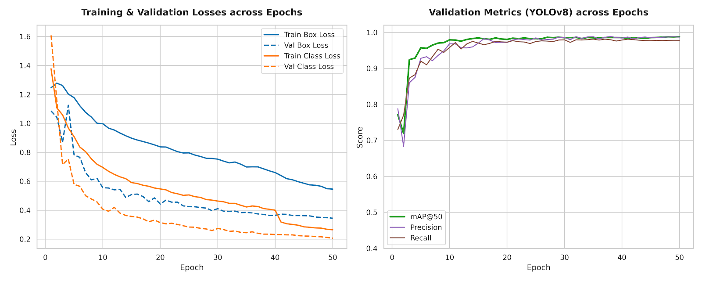

# 🔍 Visión Computacional para el Control de Calidad Industrial: Detección de Defectos en Pinzas con YOLOv8

Este proyecto consiste en el desarrollo e implementación de una solución de Visión Computacional integral (*end-to-end*) diseñada de forma totalmente independiente para automatizar el control de calidad en líneas de producción industrial. Utilizando la arquitectura **YOLOv8**, el modelo es capaz de detectar, localizar y clasificar pinzas en tiempo real en dos categorías diferenciadas: funcionales (`pinza_apta`) y defectuosas (`pinza_defectuosa`).

El objetivo principal es reducir el margen de error humano en inspecciones visuales repetitivas, optimizando los tiempos de empaquetado y asegurando que solo los componentes que cumplen con los estándares de calidad avancen en la cadena de distribución.

---

## 🛠️ Tecnologías y Herramientas
* **Lenguaje:** Python 3.x
* **Framework Principal:** Ultralytics YOLOv8
* **Entorno de Entrenamiento:** Google Colab (Acelerado por GPU)
* **Gestión de Dataset y Etiquetado:** Roboflow (Proyecto Privado: `MVP_Pinzas_Feria`)

## 📊 Rendimiento y Evaluación del Modelo
El modelo ha sido evaluado exhaustivamente utilizando un conjunto de datos de prueba independiente, demostrando métricas de alta precisión idóneas para entornos de producción reales:

| Métrica | Valor |
| :--- | :--- |
| **mAP@50** (Global) | **92.1%** |
| **Precisión (Precision)** | **97.2%** |
| **Exhaustividad (Recall)** | **94.7%** |
| **F1-Score** | **95.9%** |

### Precisión Detallada por Clase (mAP@50)
* **`pinza_apta` (Funcional):** 100%
* **`pinza_defectuosa` (Defectuosa):** 92.0%

> 💡 **Análisis Técnico:** El modelo alcanza una tasa de precisión del 97.2%, lo que garantiza una minimización drástica de los falsos positivos. En el contexto de control de calidad, esto evita el descarte erróneo de piezas perfectamente funcionales, optimizando los costes de material.

### Curvas de Aprendizaje y Métricas de Validación
A continuación se muestran las curvas de pérdida (*loss*) tanto de entrenamiento como de validación, junto con la evolución de la Precisión, el Recall y el mAP global recolectados durante la sesión de entrenamiento:



---

## ⚙️ Configuración del Entrenamiento e Hiperparámetros (`args.yaml`)
Para garantizar la total reproducibilidad del proyecto, el proceso de entrenamiento se rigió estrictamente por los parámetros técnicos registrados en el archivo `args.yaml`[cite: 1]:

* **Modelo Base**: `yolov8s.pt` (YOLOv8 Small), elegido para asegurar un compromiso óptimo entre una alta velocidad de inferencia en milisegundos y la precisión necesaria para capturar anomalías estructurales pequeñas[cite: 1].
* **Tipo de Tarea**: Configurado específicamente para la detección y localización de objetos (`task: detect`, `mode: train`)[cite: 1].
* **Resolución de Entrada (`imgsz`)**: Imágenes normalizadas a una resolución de 640x640 píxeles[cite: 1].
* **Épocas de Entrenamiento (`epochs`)**: 50 épocas completas[cite: 1].
* **Tamaño de Lote (`batch`)**: 16 imágenes por lote[cite: 1].
* **Aumentación de Datos**: Se emplearon técnicas avanzadas como el uso de Mosaic (1.0)[cite: 1] y giros horizontales (`fliplr: 0.5`)[cite: 1] con el fin de robustecer el modelo ante variaciones críticas de luz, rotación y encuadre de la cámara en la planta de producción.

---

## 📁 Estructura del Repositorio
El repositorio está organizado de manera limpia y modular para facilitar su exploración y uso:

```text
├── data/
│   ├── sample_images/     # Imágenes en bruto para evaluar la inferencia del modelo
│   └── data.yaml          # Archivo de configuración con las clases asignadas
├── models/
│   └── best.pt            # Pesos finales del modelo entrenado (listos para producción)
├── src/
│   └── predict.py         # Script personalizado en Python para ejecutar el pipeline de inferencia
├── args.yaml              # Registro original completo de hiperparámetros de la sesión[cite: 1]
└── training_plots.png     # Gráficas de convergencia de pérdidas y métricas de validación